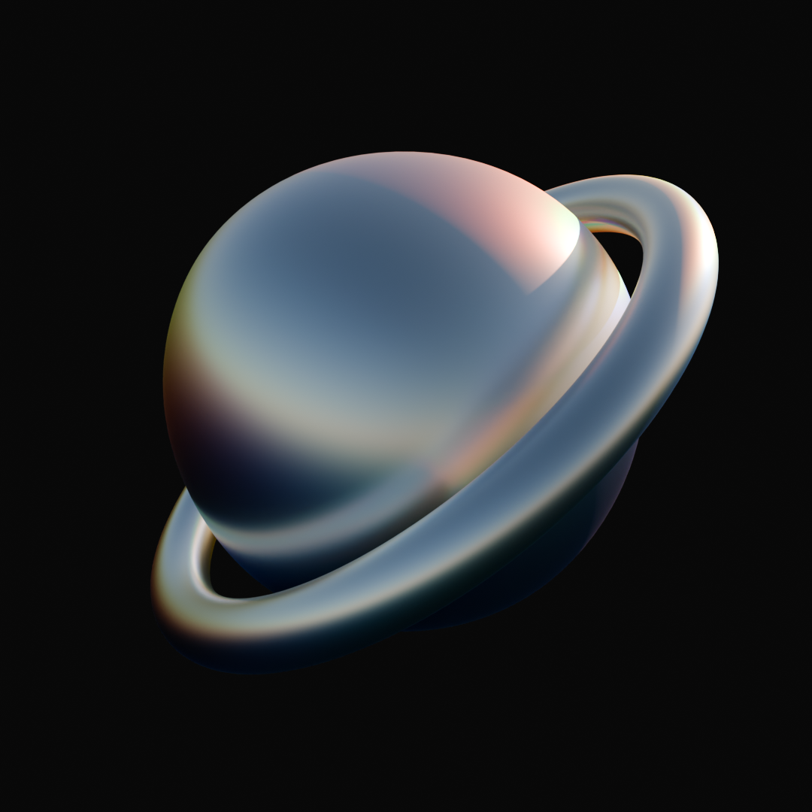
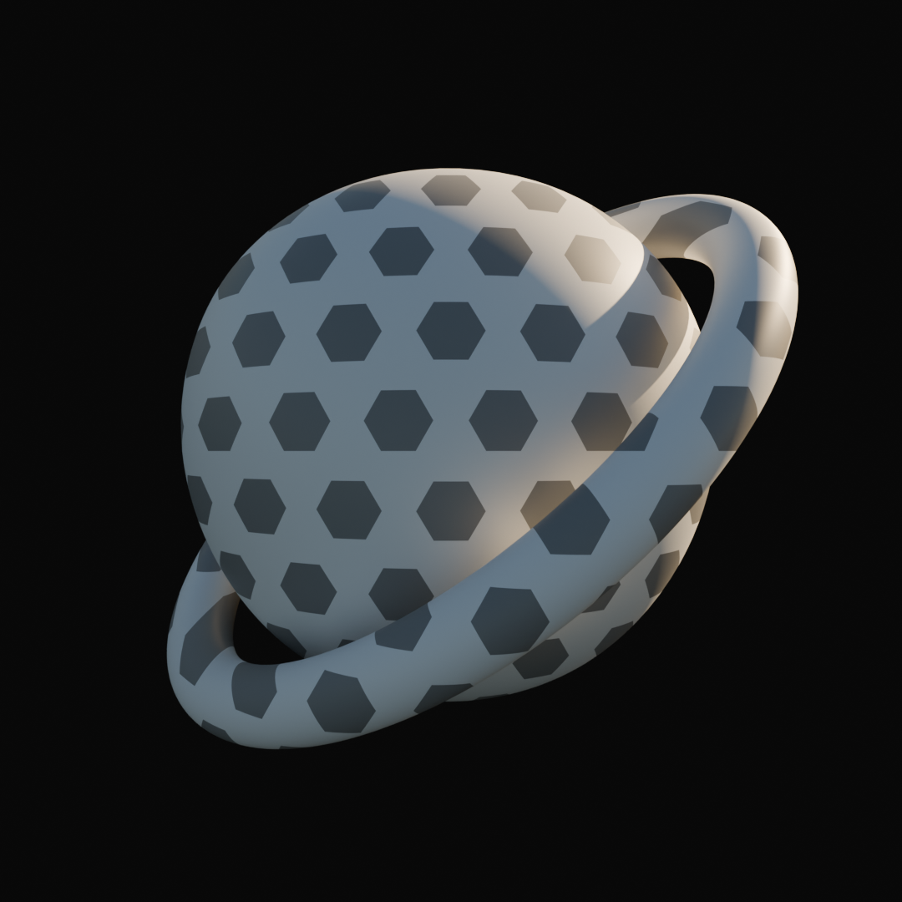
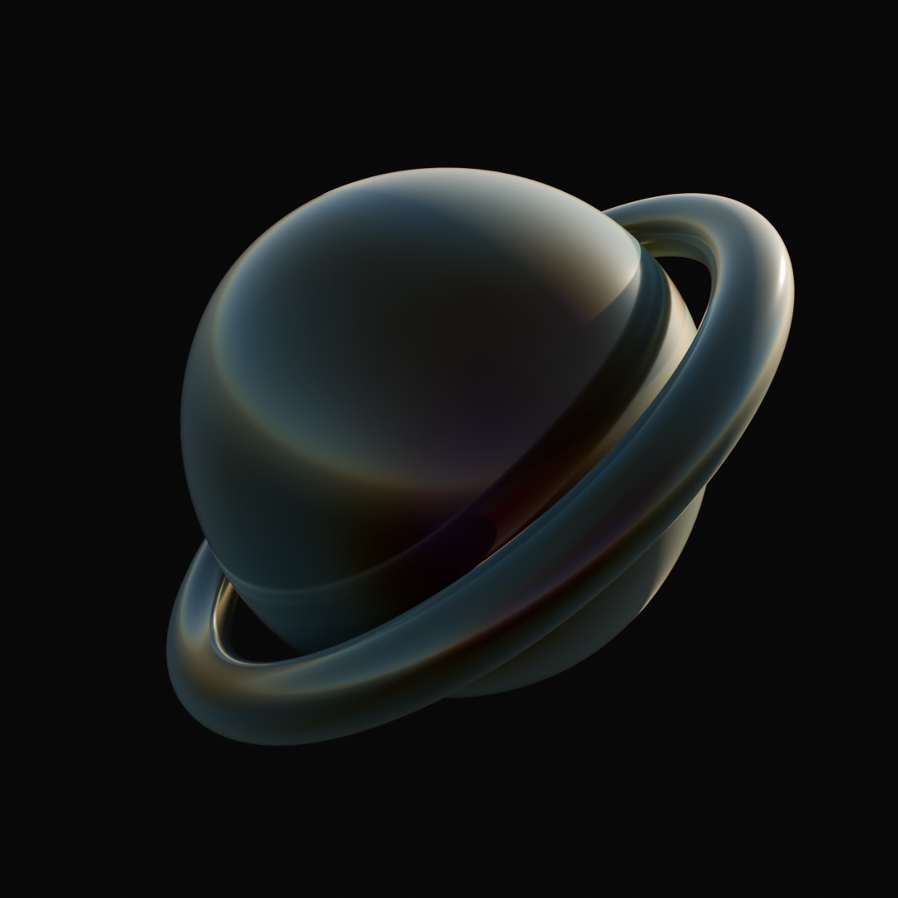
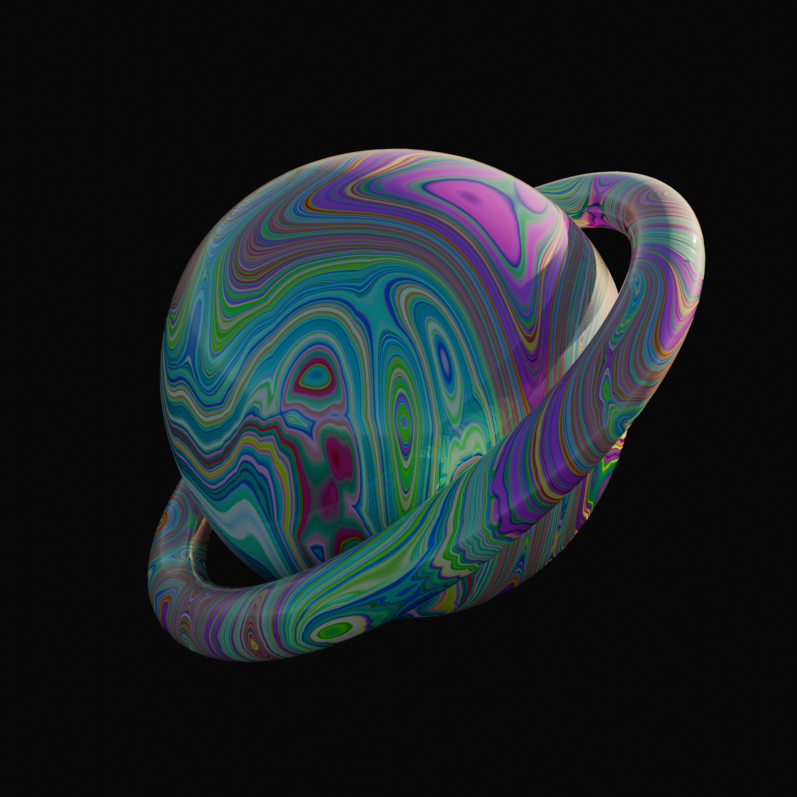
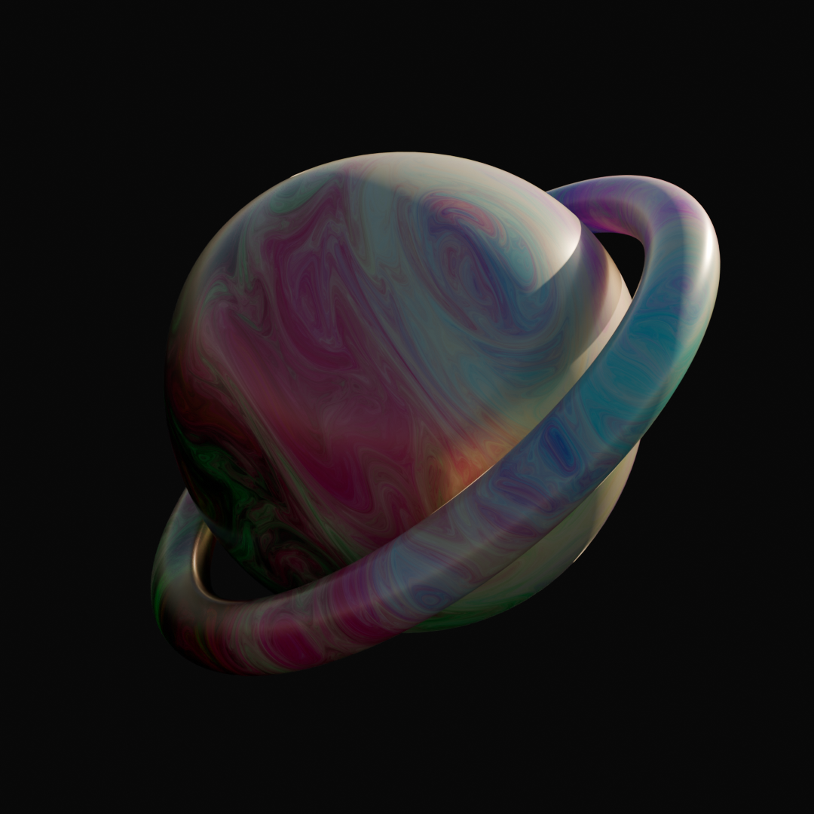
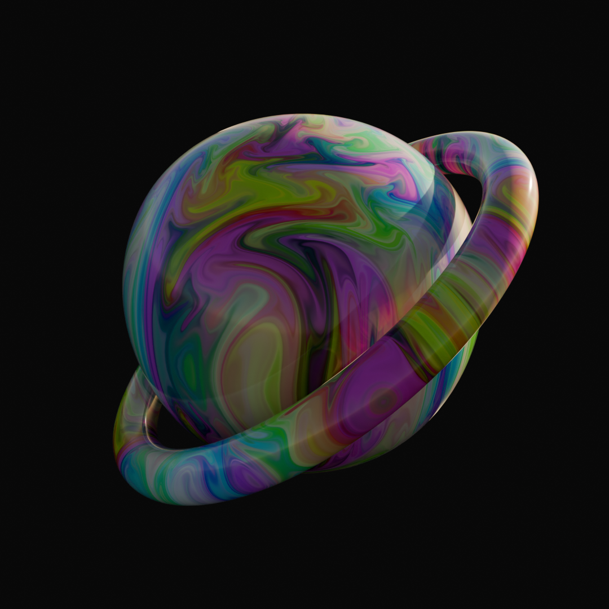
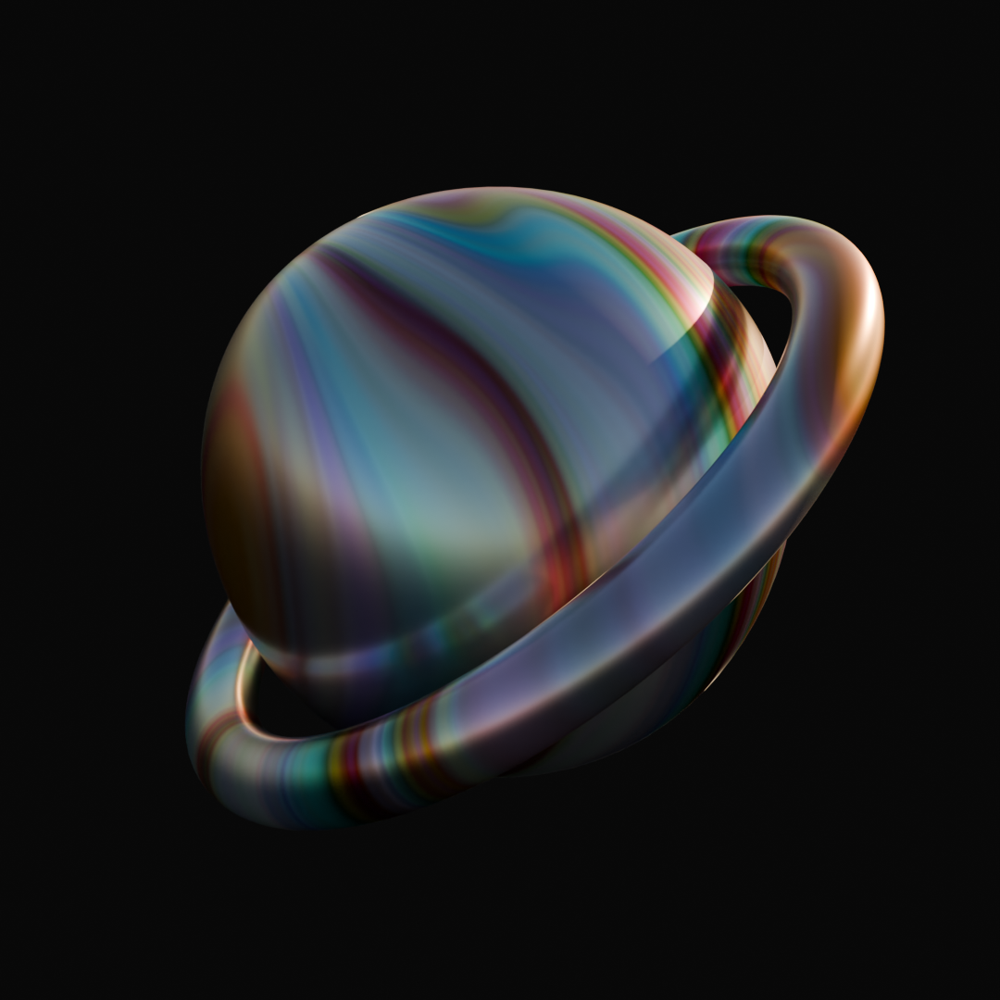
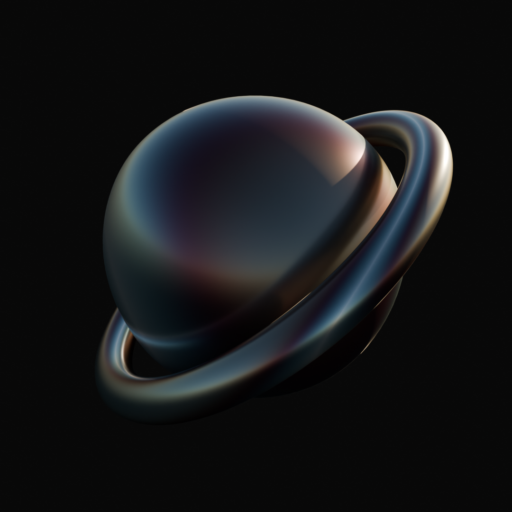
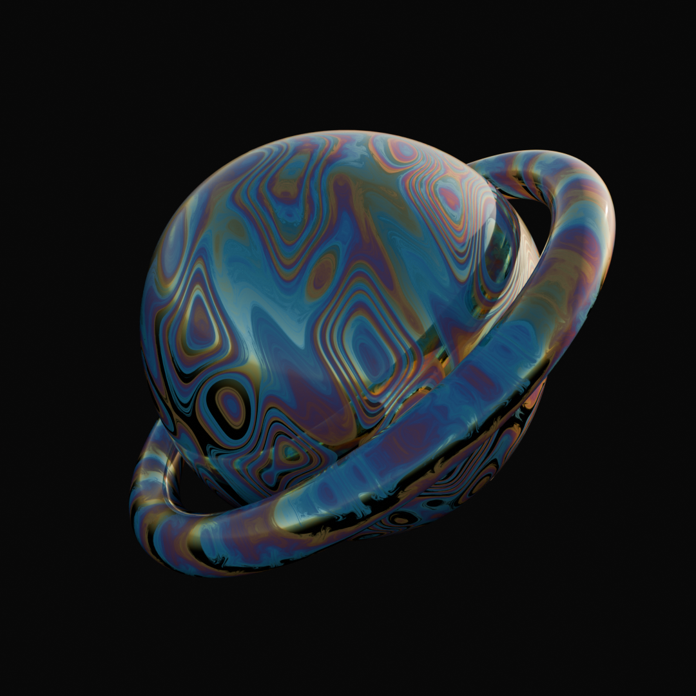

# **_Shaders &mdash; OSL_**

Open Shading Language scripts for use in compatible browsers.

### Diffraction Gating

### Hexagons

### Iridescence

### Noise Layers

### Paint Mix

### Paint

### Substance Flow

### Thin Film Interference

### Turbulence

